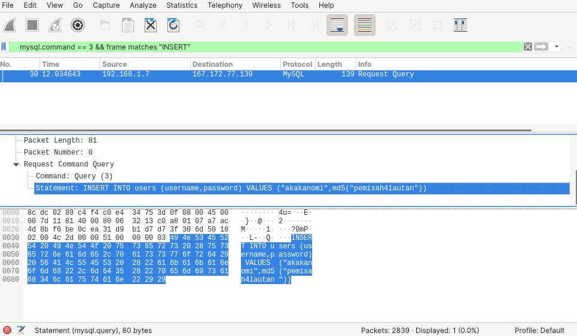

# Jarkom-Modul-1-C07-2021

## Soal 1

```
Sebutkan webserver yang digunakan pada "ichimarumaru.tech"!
```

Filter yang digunakan : `http.host == "ichimarumaru.tech"`.

Web Server : nginx.

Cara mendapatkan :<br>
Setelah membuka kumpulan paket yang ada di dalam "1-5.pcap", pada isian kolom _display filter_, masukkan _syntax_ yang diberikan.<br>
<br><br>
_Syntax_ tersebut akan menghasilkan dua paket. Pilih salah satu paket. Kemudian **_follow TCP stream_** untuk melihat web server yang digunakan.<br>


## Soal 2

```
Temukan paket dari web-web yang menggunakan basic authentication method!
```

Filter yang digunakan : `http.authbasic`.

Cara mendapatkan : <br>
Setelah membuka kumpulan paket yang ada di dalam "1-5.pcap", pada isian kolom _display filter_, masukkan _syntax_ yang diberikan.<br>


## Soal 3

```
Ikuti perintah di basic.ichimarumaru.tech! Username dan password bisa didapatkan dari file .pcapng!
```

Filter yang digunakan : `http.host == "basic.ichimarumaru.tech"`.

```
Username : kuncimenujulautan
Password : tQKEJFbgNGC1NCZlWAOjhyCOm6o3xEbPkJhTciZN
```

Cara mendapatkan :<br>
Masukkan _syntax_ filter yang diberikan pada kolom _display filter_. Kemudian cari satu per satu paket yang ditampilkan hingga menemukan credentials yang diperlukan sehingga username dan password dapat ditemukan.<br>
<br><br>
Setelah itu gunakan username dan password untuk membuka halaman login `basic.ichimarumaru.tech`.<br>
<br><br>
Lalu muncul halaman website yang menanyakan urutan konfigurasi kabel T568A.<br>


Urutan konfigurasi kabel T568A :

1. Putih Hijau
2. Hijau
3. Putih Orange
4. Biru
5. Putih Biru
6. Orange
7. Putih Coklat
8. Coklat

## Soal 4

```
Temukan paket mysql yang mengandung perintah query select!
```

Filter yang digunakan : `mysql.command == 3 && frame matches "SELECT"`.

Cara mendapatkan :<br>
Masukkan _syntax_ filter `mysql.command == 3 && frame matches "SELECT"` untuk mengetahui paket-paket mysql yang mengandung perintah query select.<br>


## Soal 5

```
Login ke portal.ichimarumaru.tech kemudian ikuti perintahnya! Username dan password bisa didapat dari query insert pada table users dari file .pcap!
```

Filter yang digunakan : `mysql.command == 3 && frame matches "INSERT"`.

Cara mendapatkan :<br>
Masukkan _syntax_ filter yang diberikan pada kolom _display filter_. Kemudian didapatkan `username : akakanomi dan password : pemisah4lautan` (untuk login ke `portal.ichimarumaru.tech`).<br>
<br><br>
Setelah itu login ke `portal.ichimarumaru.tech` dengan username dan password yang telah diketahui.
<br><br>
Lalu muncul halaman website yang menanyakan urutan konfigurasi kabel T568B.<br>
<br>


Urutan konfigurasi kabel T568B :

1. Putih Orange
2. Orange
3. Putih Hijau
4. Biru
5. Putih Biru
6. Hijau
7. Putih Coklat
8. Coklat

## Soal 6

```
Cari username dan password ketika melakukan login ke FTP Server!
```

Filter yang digunakan : `ftp.request.command == "USER" || ftp.request.command == "PASS"`

Cara mendapatkan : <br>
Masukkan _syntax_ filter yang diberikan kedalam kolom isian _display filter_.<br>
<br><br>
Kemudian **_follow TCP stream_** dan akan muncul `Username : secretuser dan Password : aku.pengen.pw.aja`.<br>


## Soal 7

```
Ada 500 file zip yang disimpan ke FTP Server dengan nama 0.zip, 1.zip, 2.zip, ..., 499.zip. Simpan dan Buka file pdf tersebut. (Hint = nama pdf-nya "Real.pdf")
```

Filter yang digunakan : `frame contains "Real.pdf"`

Cara mendapatkan : <br>
Masukkan _syntax_ filter yang diberikan kedalam kolom isian _display filter_.<br>
<br><br>
Kemudian **_follow TCP stream_** dan download file tersebut dalam format zip.<br>
<br>
<br>
<br><br>
Setelah itu ekstrak file zip tersebut yang berisi `Real.pdf`.<br>
<br><br>
Kemudian buka file `Real.pdf`.<br>


## Soal 8

```
Cari paket yang menunjukan pengambilan file dari FTP tersebut!
```

Filter yang digunakan : `ftp.request.command == "RETR"`

Cara mendapatkan : <br>
Setelah membuka kumpulan paket yang ada di dalam "8-10.pcap", pada isian kolom _display filter_, masukkan _syntax_ yang diberikan.<br>


## Soal 9

```
Dari paket-paket yang menuju FTP terdapat indikasi penyimpanan beberapa file. Salah satunya adalah sebuah
file berisi data rahasia dengan nama "secret.zip". Simpan dan buka file tersebut!
```

Filter yang digunakan : `ftp-data.command contains "secret.zip"`

Cara mendapatkan : <br>
Setelah membuka kumpulan paket yang ada di dalam "8-10.pcap", pada isian kolom _display filter_, masukkan _syntax_ yang diberikan.<br>
<br><br>

_Syntax_ tersebut akan menampilkan paket - paket pengiriman dari file "secret.zip". Pilih salah satu paket, kemudian **_follow TCP stream_**.<br>
<br><br>

Setelah muncul tampilan menu **_follow TCP stream_**, ubah kolom pengaturan _Show Data as_ dari ASCII menjadi RAW. Kemudian, simpan filenya dengan mengklik tombol _Save AS_.<br>
<br><br>

Setelah file zip berhasil disimpan, buka file zip tersebut. Didalamnya akan terdapat file **wanted.pdf**.<br>
<br><br>

Ketika file tersebut akan dibuka, maka kita akan diminta untuk memasukkan passwordnya.<br>


## Soal 10

```
Selain itu terdapat "history.txt" yang kemungkinan berisi history bash server tersebut! Gunakan isi dari "history.txt" untuk menemukan password untuk membuka file rahasia yang ada di "secret.zip"!
```

Filter yang digunakan : (1)`ftp-data.command contains "history.txt"` & (2)`ftp-data.command contains "bukanapaapa.txt"`.

Cara mendapatkan : <br>
Setelah membuka kumpulan paket yang ada di dalam "8-10.pcap", pada isian kolom _display filter_, masukkan _syntax_ (1) yang diberikan.<br>
<br><br>

_Syntax_ tersebut akan menampilkan paket pengiriman data dari file "history.txt". Klik paket tersebut, kemudian **_follow TCP stream_**. Maka akan terlihat menu seperti berikut.<br>
<br><br>

Dari menu tersebut, terlihat sebuah perintah _bash_ yang menunjukkan bahwa _key_ dari file _secret.zip_ berada di dalam file **bukanapaapa.txt**. Oleh karena itu, kita harus men-_trace_ paket data pengiriman dari file **bukanapaapa.txt** dengan memasukkan _syntax_ (2) yang diberikan pada kolom display filter _wireshark_.<br>
<br><br>

Setelah mendapatkan paketnya, klik paket tersebut kemudian **_follow TCP stream_**. Maka akan terlihat menu seperti berikut.<br>
<br><br>

Terlihat bahwa kita telah berhasil menemukan password untuk file _wanted.pdf_ yaitu **_d1b1langbukanapaapajugagapercaya_**. Ketikan password dimasukkan dan file dibuka, maka akan muncul poster _bounty_ dari Monkey D. Luffy.<br>
<br><br>

## Soal 11

```
Filter sehingga wireshark hanya mengambil paket yang berasal dari port 80!
```

Karena perintah yang digunakan adalah mengambil paket, maka kita menggunakan capture filter. kemudian kita input "src port 80" karena berasal dari port 21. Karena port 80 merupakan http, maka kita perlu membuka web yang menggunakan http. Kita membuka monta untuk mencoba.

<br><br>
<br><br>

## Soal 12

```
Filter sehingga wireshark hanya mengambil paket yang mengandung port 21!
```

Karena perintah yang digunakan adalah mengambil paket, maka kita menggunakan capture filter. kemudian kita input "port 21" karena ingin menangkap yang berasal atau menuju. Karena port 21 merupakan port server, maka kita perlu membuka filezilla agar tampil.

<br><br>

## Soal 13

```
Filter sehingga wireshark hanya menampilkan paket yang menuju port 443!
```

Karena perintah yang digunakan adalah menampilkan paket, maka kita menggunakan display filter. kemudian kita input "dst port 443".

<br><br>

## Soal 14

```
Filter sehingga wireshark hanya mengambil paket yang tujuannya ke kemenag.go.id!
```

Karena perintah yang digunakan adalah mengambil paket, maka kita menggunakan capture filter. Kita menggunakan IP kemenag untuk mengambil paket. untuk mengambil paket, Kita perlu mencari dari cmd.

<br><br>

kemudian input syntax di wireshark, yaitu

<br><br>
<br><br>

## Soal 15

```
Filter sehingga wireshark hanya mengambil paket yang berasal dari ip kalian!
```
Karena perintah yang digunakan adalah mengambil paket, maka kita menggunakan capture filter. Kita menggunakan IP kita untuk mengambil paket. untuk mengambil paket, Kita perlu mencari dari cmd.

<br><br>

kemudian input syntax di wireshark, yaitu 

<br><br>
<br><br>
